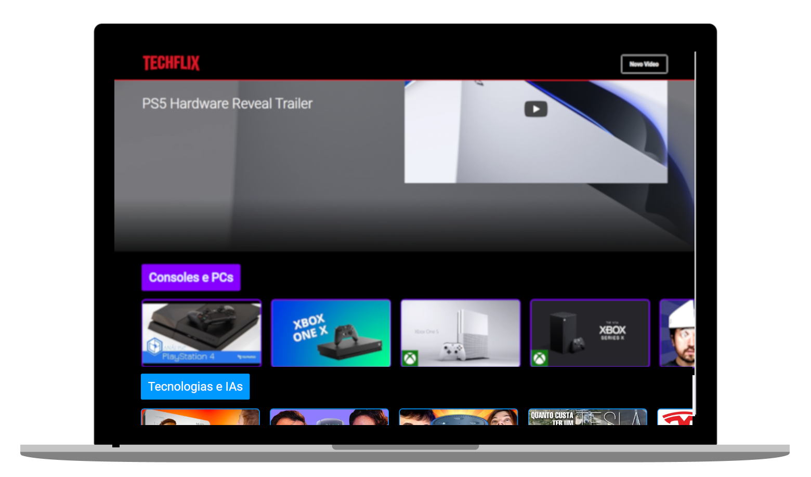
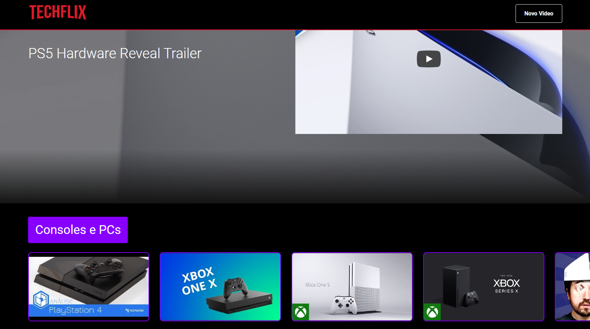
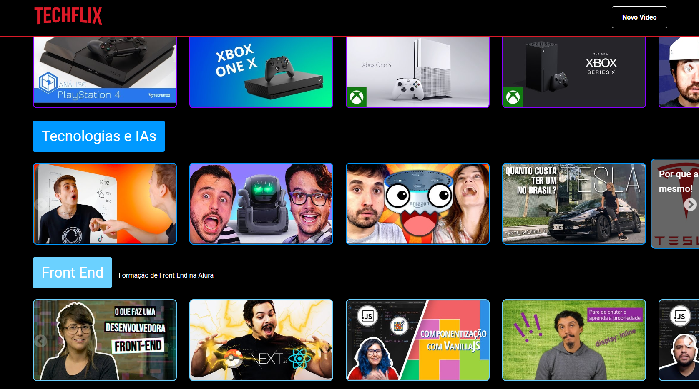
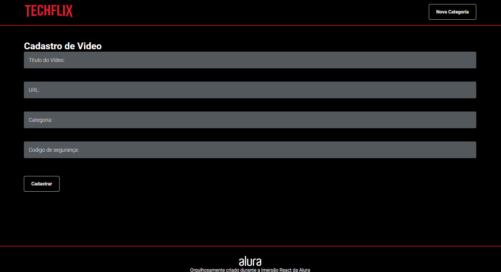
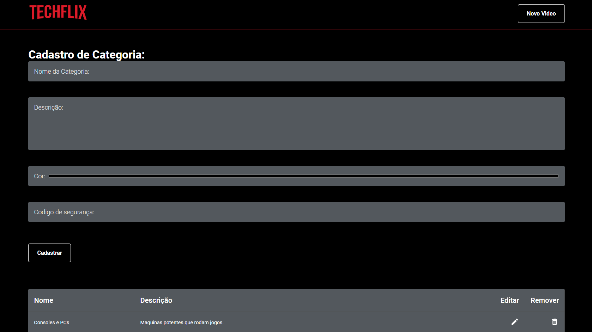
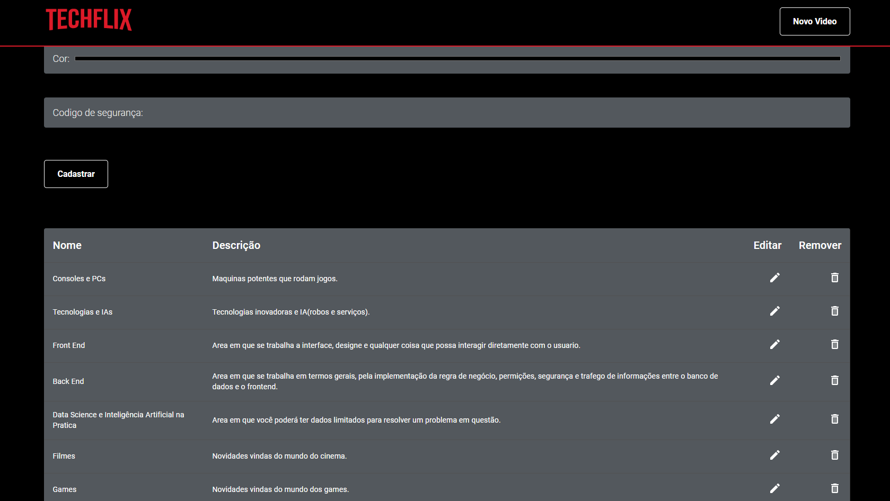

<div align="center">
<h1 align="center">
    
</h1>
    
![Npm_Badge][npm_version_badge] ![Node_Badge][node_version_badge] ![React_Badge][web_react_badge] ![GitHub][repository_license_badge]
</div>
<div align="center">


<br>

<p align="center">
   <strong>
      <a href="#-Preview">Preview</a> &nbsp;&nbsp;|&nbsp;&nbsp;
  </strong>
  <strong>
      <a href="#-projeto">Projeto</a> &nbsp;&nbsp;|&nbsp;&nbsp;
  </strong>
  <strong>
      <a href="#-layout">Layout</a> &nbsp;&nbsp;|&nbsp;&nbsp;
  </strong>
  <strong>
      <a href="#-tecnologias">Tecnologias</a> &nbsp;&nbsp;|&nbsp;&nbsp;
  </strong>
  <strong>
      <a href="#-como-executar-o-projeto">Executando</a> &nbsp;&nbsp;|&nbsp;&nbsp;
  </strong>
  <strong>
      <a href="#-referências">Referências</a>
  </strong>
</p>

<br>

<p align="center">
  
</p>

</div>


## **✨ Preview**
#### Sistema Online: https://techflixseries.vercel.app

---

**## 💻 Projeto**

A "Techflix" é um projeto inspirado na Netflix, utilizando videos do youtube como fonte de conteudo ou divulgação, podendo assitir os videos do proprio site e cadastrar novos videos e categorias, feito na "Imersão React Alura".

**## 🔖 Layout**

Você pode visualizar o layout do projeto no formato através [desse link](https://www.figma.com/file/7Y88iwIZCqJJuCmHL2MkDZ/AluraFlix?node-id=276%3A349). Lembrando que você irá precisar ter uma conta no [Figma](http://figma.com/).

#### **Web**
<p align="center">
  
</p>
<p align="center">
  
</p>
<p align="center">
  
</p>
<p align="center">
  
</p>
<p align="center">
  
</p>
<p align="center">
  
</p>


## **💻 Tecnologias**


#### **Website** ([React][react])

  - **[React Router Dom][react_router_dom]**
  - **[Material UI][material_ui]**
  - **[Google Fonts][google_fonts]**
  - **[Styled Components][styled_components]**
  - **[Concurrently][concurrently]**
  - **[Eslint][eslint]**
  

  \* Veja o arquivo <kbd>[package.json](./project/mobile/package.json)</kbd>

#### **Utilitários**

- Editor: **[Visual Studio Code][vscode]** &rarr; 
- Markdown: **[StackEdit][stackedit]**, **<kbd>[Markdown Emoji][markdown_emoji]</kbd>**
- Fontes: **[Roboto][font_roboto]**


## **🚀 Como executar o projeto**

### Configurações Iniciais

Primeiro, você precisa ter o <kbd>[NodeJS](https://nodejs.org/en/download/)</kbd> instalado na sua máquina. 

Se você estiver utilizando o **Linux**, você pode optar por instalar o **Node** através do gerênciador de versões <kbd>[asdf]</kbd> para facilitar o processo de mudança da versão do **Node**, quando for necessário.

Você pode optar também por utilizar o **yarn** no lugar do **npm**. Você pode instalar clicando nesse <kbd>[link][yarn]</kbd>, ou através do <kbd>[asdf]</kbd>.

Instale as dependências contidas nos arquivos `package.json` que se encontram na raíz do repositório basta abrir o terminal no diretório e digitar o comando:

```sh
$ npm install

# ou
$ yarn
```
Veja o arquivo **`package.json`** .


### Executando o Website

```sh
# Executando o website:
$ npm run dev

# ou
$ yarn dev
```

> Se o browser não abrir automaticamente, acesse: http://localhost:3000.

## **📚 Referências**

- [ReactJS](https://reactjs.org/docs/getting-started.html) | [ReactJS pt-BR](https://pt-br.reactjs.org/docs/getting-started.html)
- [React Native](https://reactnative.dev/docs/getting-started)
- [Node](https://nodejs.org/en/)


## :memo: Licença

Esse projeto está sob a licença MIT. Veja o arquivo [LICENSE](LICENSE.md) para mais detalhes.

<!-- Badges -->

[repository_license_badge]: https://img.shields.io/github/license/JairoDoni/NLW-1.0

[node_version_badge]: https://img.shields.io/badge/node-12.18.0-green

[npm_version_badge]: https://img.shields.io/badge/npm-6.14.5-red

[web_react_badge]: https://img.shields.io/badge/web-react-blue

[server_nodejs_badge]: https://img.shields.io/badge/server-nodejs-important

<!-- Techs -->

[react]: https://reactjs.org/

[node]: https://nodejs.org/en/

[vscode]: https://code.visualstudio.com/

[react_native]: http://www.reactnative.com/

[stackedit]: https://stackedit.io

[markdown_emoji]: https://gist.github.com/rxaviers/7360908

[commitlint]: https://github.com/conventional-changelog/commitlint

[styled_components]: https://styled-components.com

[react_router_dom]: https://github.com/ReactTraining/react-router/tree/master/packages/react-router-dom

[material_ui]: https://material-ui.com/pt/

[google_fonts]: https://fonts.google.com/

[font_roboto]: https://fonts.google.com/specimen/Roboto

[concurrently]: https://github.com/kimmobrunfeldt/concurrently

[eslint]: https://eslint.org/docs/user-guide/getting-started

[asdf]: https://github.com/asdf-vm/asdf

[yarn]: https://classic.yarnpkg.com/en/docs/install/#debian-stable
